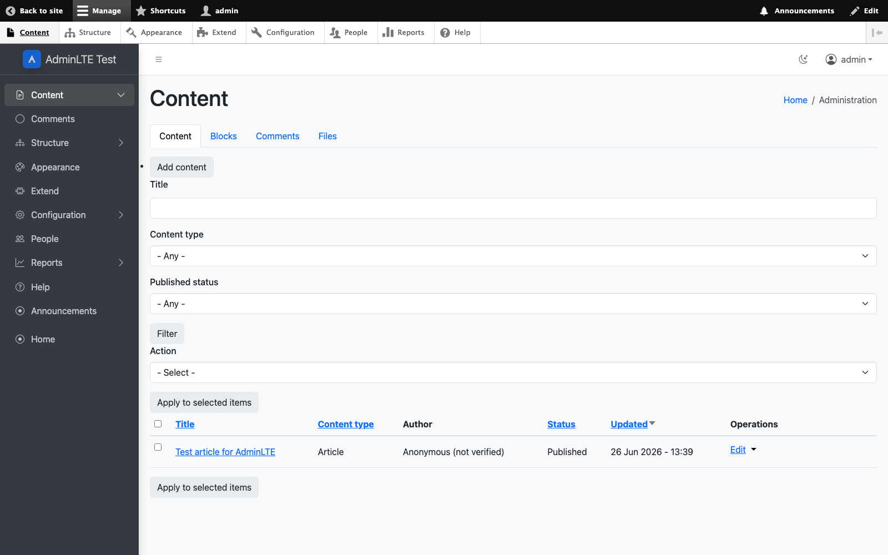
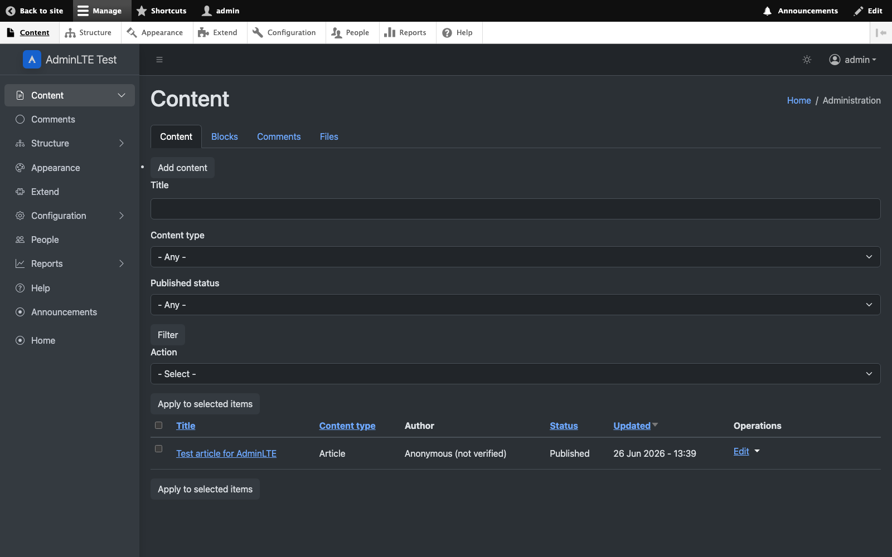

# AdminLTE 4 for Drupal

[](LICENSE)
[](https://www.drupal.org/)
[](https://getbootstrap.com/docs/5.3/)

Official **AdminLTE 4** admin theme for **Drupal** — Bootstrap 5.3, vanilla JS
(no jQuery), light & dark colour modes. Self-contained: all assets are bundled
locally, no CDN required. By [Colorlib](https://colorlib.com).

Verified on **Drupal 11.3** (PHP 8.5): clean install, no errors/warnings in the
log, all admin screens render with the AdminLTE shell in both colour modes.

<p align="center">
  
  
</p>

## Also available for your stack

The same AdminLTE 4 dashboard, in the framework you know best — you're looking at the **Drupal** edition:

<!-- ADMINLTE-ECOSYSTEM:START -->
<div align="center">
  <a href="https://github.com/ColorlibHQ/AdminLTE"></a>
  <a href="https://github.com/ColorlibHQ/adminlte-react"></a>
  <a href="https://github.com/ColorlibHQ/adminlte-react"></a>
  <a href="https://github.com/ColorlibHQ/adminlte-vue"></a>
  <a href="https://github.com/ColorlibHQ/adminlte-vue"></a>
  <a href="https://github.com/ColorlibHQ/adminlte-angular"></a>
  <a href="https://github.com/ColorlibHQ/adminlte-laravel"></a>
  <a href="https://github.com/ColorlibHQ/adminlte-symfony"></a>
  <a href="https://github.com/ColorlibHQ/adminlte-django"></a>
  <a href="https://github.com/ColorlibHQ/adminlte-aspnet"></a>
  <a href="https://github.com/ColorlibHQ/adminlte-drupal"></a>
  <a href="https://docs.adminlte.io"></a>
</div>
<!-- ADMINLTE-ECOSYSTEM:END -->

> Also available as the original [AdminLTE](https://github.com/ColorlibHQ/AdminLTE) (HTML · Bootstrap 5.3 · vanilla JS — [demo](https://adminlte.io/themes/v4/)).

## Requirements

- Drupal **10.3+** or **11**
- PHP 8.1+ (as required by your Drupal core version)

## Installation

### With Composer (recommended)

While the theme is in **beta** (no stable release yet), request it explicitly —
Composer's default `minimum-stability: stable` would otherwise skip pre-releases:

```bash
composer require 'drupal/adminlte:^1.0@beta'
drush theme:enable adminlte
drush config:set system.theme admin adminlte   # use as the administration theme
```

Once **1.0.0** stable is released, the plain `composer require drupal/adminlte` will work.

### Manual

1. Download the theme and extract it into `themes/contrib/adminlte`.
2. Visit **Appearance** (`/admin/appearance`).
3. Under *Uninstalled themes*, click **Install** (or **Install and set as default**)
   next to **AdminLTE 4**.
4. To use it only for the admin UI, set it as the **Administration theme** at
   `/admin/appearance` → *Administration theme*.

On enable, the theme ships default block placement (`config/install`), so the
sidebar menu, navbar, breadcrumbs, tabs, messages and content render immediately.

## Regions

| Region          | AdminLTE location                          |
|-----------------|--------------------------------------------|
| `navbar_left`   | Top navbar, after the sidebar toggle       |
| `navbar_right`  | Top navbar, right (account menu, toggle)   |
| `sidebar_brand` | Sidebar header (site logo + name)          |
| `sidebar`       | Sidebar treeview menu                      |
| `page_title`    | Content header (left)                      |
| `breadcrumb`    | Content header (right)                     |
| `highlighted`   | Status messages                            |
| `help`          | Contextual help                            |
| `content`       | Main content (tabs, actions, page content) |
| `footer`        | App footer                                  |
| `page_top` / `page_bottom` | Reserved for core (admin toolbar) |

## Theme settings

At `/admin/appearance/settings/adminlte`:

- **Default colour mode** — `auto` (follow OS), `light` or `dark`. Visitors can
  override it with the navbar toggle; their choice is remembered in the browser.
- **Dark sidebar** — render the sidebar dark regardless of page mode (applied via
  `data-bs-theme="dark"` on the sidebar).

## What's bundled

| Asset | Notes |
|-------|-------|
| `css/adminlte.css` | AdminLTE 4 styles — **Bootstrap 5.3 CSS included** |
| `js/adminlte.js` | AdminLTE behaviours (sidebar, treeview) |
| `js/vendor/bootstrap.bundle.min.js` | Bootstrap 5.3 + Popper |
| `css/vendor/bootstrap-icons.min.css` + fonts | Bootstrap Icons 1.13 |

Everything is served from the theme — no external CDN calls.

## Tested

Verified against a clean **Drupal 11.3.13** install (standard profile, PHP 8.5):

- All core admin screens (dashboard, content, structure, modules, people, reports,
  appearance, node add/edit) render with the AdminLTE shell and return HTTP 200.
- No errors or warnings in the Drupal log after a full browse.
- The **sidebar** shows the Administration menu as a collapsible treeview with
  per-section icons; the active section is highlighted and auto-expanded.
- Page title, breadcrumb, admin tabs, local actions, status messages, the
  navbar user dropdown and the site-branding sidebar brand all render correctly.
- Light and dark colour modes, the navbar mode toggle, and coexistence with the
  Drupal admin **toolbar** (using `--drupal-displace-offset-top`) all work.

## Known limitations

- The bridge CSS covers common form/button/table markup; very complex admin
  screens (Views UI drag-and-drop, Field UI, Media Library) may benefit from
  extra styling.
- **Gin**-style toolbar coexistence is not specifically tuned (core toolbar is).

Issues and patches welcome.

## Credits

Built on [AdminLTE 4](https://github.com/ColorlibHQ/AdminLTE) by
[Colorlib](https://colorlib.com). Drupal theme requested in
[ColorlibHQ/AdminLTE#6057](https://github.com/ColorlibHQ/AdminLTE/discussions/6057).

## License

GPL-2.0-or-later, per Drupal.org requirements. Bundled AdminLTE, Bootstrap and
Bootstrap Icons assets are MIT (GPL-compatible). See [LICENSE](LICENSE).
